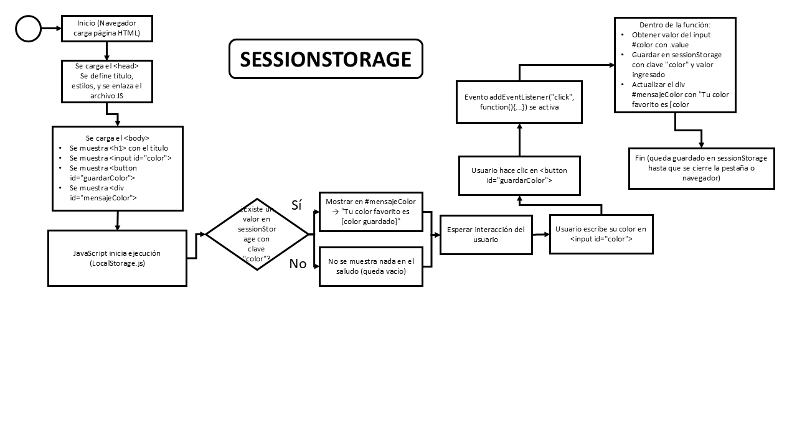
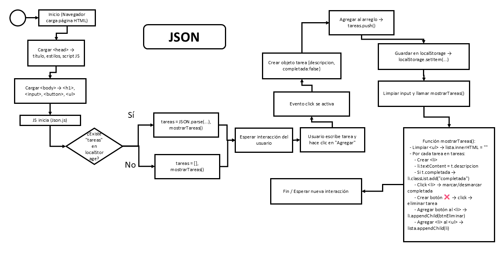

# JS-Storage-JSON-Debug

Este repositorio muestra **LocalStorage y SessionStorage**, **JSON**, y **depuración con console.log y debugger**.

## Explicación 

- 🫰 **LocalStorage / SessionStorage**:  
  Guardan datos en el navegador; LocalStorage persiste incluso al cerrar el navegador, SessionStorage dura solo la sesión.

- 🫰 **JSON**:  
  Formato de texto para almacenar y transferir datos entre aplicaciones.

- 🫰 **Console.log / debugger**:  
  Ayudan a ver y depurar el código, mostrando valores de variables y pausando la ejecución para inspección.
 ## Diagrama de flujo de LocalStorage
## LocalStorage

### 📌 Ejemplo HTML
```html
<!DOCTYPE html>
<html lang="es">
<head>
  <meta charset="UTF-8">
  <title>Ejemplo localStorage y sessionStorage</title>
  <style>
    body { font-family: Arial, sans-serif; padding: 20px; }
    input { margin: 5px 0; padding: 5px; }
    button { margin: 5px; padding: 5px 10px; }
    .caja { margin-top: 15px; padding: 10px; border: 1px solid #ccc; }
  </style>
</head>
<body>
  <h1>Ejemplo con localStorage y sessionStorage</h1>

  <div class="caja">
    <h3>Nombre (localStorage)</h3>
    <input type="text" id="nombre" placeholder="Escribe tu nombre">
    <button id="guardarNombre">Guardar nombre</button>
    <p id="saludo"></p>
  </div>

  <div class="caja">
    <h3>Color favorito (sessionStorage)</h3>
    <input type="text" id="color" placeholder="Escribe tu color favorito">
    <button id="guardarColor">Guardar color</button>
    <p id="mensajeColor"></p>
  </div>

  <script src="LocalStorage.js"></script>
</body>
</html>
```

### 📌 Ejemplo Javascript

```javascript
if(localStorage.getItem("nombre")){
    document.getElementById("saludo").textContent =
    "¡Hola de nuevo, " + localStorage.getItem("nombre") + "!";
}

document.getElementById("guardarNombre").addEventListener("click", function(){
  let nombre = document.getElementById("nombre").value;
  localStorage.setItem("nombre", nombre);
  document.getElementById("saludo").textContent = "¡Hola, " + nombre + "!";
});

if(sessionStorage.getItem("color")){
  document.getElementById("mensajeColor").textContent =
    "Tu color fav en esta sesión es: " + sessionStorage.getItem("color");
}

document.getElementById("guardarColor").addEventListener("click", function(){
  let color = document.getElementById("color").value;
  sessionStorage.setItem("color", color);
  document.getElementById("mensajeColor").textContent =
    "Tu color favorito en esta sesión es: " + color;
});
```
## 📸 Captura de localSession


## 📸 Captura de SessionStorage



## JSON
### 📌 Ejemplo HTML
```
<!DOCTYPE html>
<html lang="es">
<head>
  <meta charset="UTF-8">
  <title>Lista de Tareas con JSON</title>
  <style>
    body { font-family: Arial, sans-serif; padding: 20px; }
    input, button { padding: 8px; margin: 5px 0; }
    ul { list-style: none; padding: 0; }
    li { margin: 5px 0; padding: 5px; background: #f2f2f2; border-radius: 5px; }
    .completada { text-decoration: line-through; color: gray; }
  </style>
</head>
<body>
  <h1>Lista de Tareas</h1>
  <input type="text" id="tareaInput" placeholder="Escribe una tarea">
  <button id="agregarBtn">Agregar</button>
  <ul id="listaTareas"></ul>

  <script src="Json.js"> </script>
</body>
</html>

```
### 📌 Ejemplo Javascript
```
let tareas = [];

if(localStorage.getItem("tareas")){
  tareas = JSON.parse(localStorage.getItem("tareas"));
  mostrarTareas();
}

document.getElementById("agregarBtn").addEventListener("click", () => {
  let texto = document.getElementById("tareaInput").value;
  if(texto === "") return;

  let nuevaTarea = { 
    descripcion: texto, 
    completada: false 
  };

  tareas.push(nuevaTarea);
  localStorage.setItem("tareas", JSON.stringify(tareas));
  document.getElementById("tareaInput").value = "";
  mostrarTareas();
});

function mostrarTareas(){
  let lista = document.getElementById("listaTareas");
  lista.innerHTML = "";

  tareas.forEach((t, index) => {
    let li = document.createElement("li");
    li.textContent = t.descripcion;
    if(t.completada) li.classList.add("completada");

    li.addEventListener("click", () => {
      tareas[index].completada = !tareas[index].completada;
      localStorage.setItem("tareas", JSON.stringify(tareas));
      mostrarTareas();
    });

    let btnEliminar = document.createElement("button");
    btnEliminar.textContent = "❌";
    btnEliminar.style.marginLeft = "50px";
    btnEliminar.addEventListener("click", () => {
      tareas.splice(index, 1);
      localStorage.setItem("tareas", JSON.stringify(tareas));
      mostrarTareas();
    });

    li.appendChild(btnEliminar);
    lista.appendChild(li);
  });
}

```
## 📸 Capturas


## Uso de consola
### 📌 Ejemplo Consola
```
function suma(a, b) {
  console.log("Valores recibidos:", a, b);
  debugger;
  let resultado = a + b;
  console.log("Resultado de la suma:", resultado);
  return resultado;
}

let valor1 = 5;
let valor2 = 7;
let total = suma(valor1, valor2);

console.log("Total final:", total);

```


